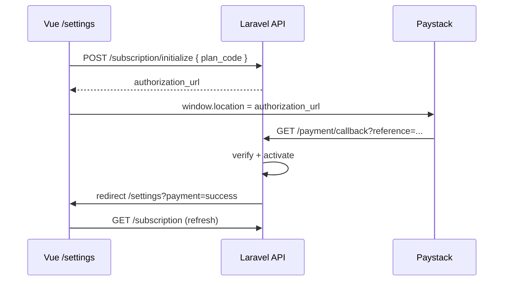

# Salono — Guide intégration Frontend Vue.js

> Abonnements (Basic / Pro), essai 7 jours, paiement Paystack.
> Stack cible : **Vue 3 + Composition API + Vue Router + Pinia + Axios**.

**Base API** : `{VITE_API_URL}/api/v1` — ex. `http://localhost:8000/api/v1`

---

## Sommaire

1. [Vue d'ensemble des écrans](#1-vue-densemble-des-écrans)
2. [Configuration projet](#2-configuration-projet)
3. [Types TypeScript](#3-types-typescript)
4. [Service API Axios](#4-service-api-axios)
5. [Store Pinia — abonnement](#5-store-pinia--abonnement)
6. [Page Pricing (`/pricing`)](#6-page-pricing-pricing)
7. [Inscription (`/register`)](#7-inscription-register)
8. [Paiement Paystack (`/settings`)](#8-paiement-paystack-settings)
9. [Bannières & garde-fous UI](#9-bannières--garde-fous-ui)
10. [Gating sidebar (plans)](#10-gating-sidebar-plans)
11. [Gestion des erreurs API](#11-gestion-des-erreurs-api)
12. [Router guards](#12-router-guards)
13. [Checklist intégration](#13-checklist-intégration)

---

## 1. Vue d'ensemble des écrans

```
/pricing          → GET /plans (public)
    ↓ clic plan
/register?plan=pro → POST /auth/register { plan_code }
    ↓ trial 7j
/dashboard        → bannière "Activer abonnement"
    ↓
/settings         → POST /subscription/initialize → redirect Paystack
    ↓ paiement
/settings?payment=success → refresh abonnement
```

| Écran | Routes API |
|-------|------------|
| Pricing | `GET /plans` |
| Register | `POST /auth/register` |
| Dashboard (connecté) | `GET /auth/me`, `GET /subscription` |
| Paiement | `POST /subscription/initialize` |
| Retour Paystack | query `?payment=success\|failed` (pas d'appel API) |

---

## 2. Configuration projet

### `.env` front

```env
VITE_API_URL=http://localhost:8000
```

### `src/api/client.ts`

```typescript
import axios from 'axios';

const api = axios.create({
  baseURL: `${import.meta.env.VITE_API_URL}/api/v1`,
  headers: { Accept: 'application/json', 'Content-Type': 'application/json' },
});

api.interceptors.request.use((config) => {
  const token = localStorage.getItem('access_token');
  if (token) config.headers.Authorization = `Bearer ${token}`;
  return config;
});

api.interceptors.response.use(
  (res) => res,
  (error) => {
    const data = error.response?.data;
    return Promise.reject({
      status: error.response?.status,
      message: data?.message ?? 'Erreur réseau',
      code: data?.code ?? null,
      errors: data?.errors ?? null,
    });
  },
);

export default api;
```

---

## 3. Types TypeScript

```typescript
// src/types/subscription.ts

export type PlanCode = 'basic' | 'pro';

export type SubscriptionStatus = 'trial' | 'active' | 'past_due' | 'cancelled' | 'expired';

export interface PlanFeature {
  key: string;
  label: string;
  included: boolean;
}

export interface PublicPlan {
  id: string;
  code: PlanCode;
  name: string;
  tagline: string | null;
  price_fcfa: number;
  price_label: string;
  max_employees: number | null;
  max_employees_label: string;
  has_analytics: boolean;
  features: PlanFeature[];
}

export interface SubscriptionPlan {
  code: PlanCode;
  name: string;
  price_fcfa: number;
  max_employees: number | null;
  max_services: number;
  has_online_booking: boolean;
  has_analytics: boolean;
}

export interface Subscription {
  id: string;
  status: SubscriptionStatus;
  is_trial: boolean;
  plan: SubscriptionPlan;
  trial_ends_at: string | null;
  ends_at: string | null;
}

export interface SubscriptionUsage {
  active_employees: number;
  max_employees: number | null;
  max_employees_label: string;
  employees_remaining: number | null;
}

export interface SalonSubscriptionPayload {
  subscription: Subscription;
  usage: SubscriptionUsage;
  features: PlanFeature[];
}

export interface PaystackInitializeResponse {
  authorization_url: string;
  access_code: string;
  reference: string;
  amount: number;
  currency: string;
  plan: { code: PlanCode; name: string; price_fcfa: number };
}

export interface ApiResponse<T> {
  success: boolean;
  message: string;
  data: T;
}
```

---

## 4. Service API Axios

```typescript
// src/api/subscription.ts
import api from './client';
import type { ApiResponse, PaystackInitializeResponse, PlanCode, PublicPlan, SalonSubscriptionPayload } from '@/types/subscription';

export const plansApi = {
  list: () => api.get<ApiResponse<PublicPlan[]>>('/plans'),
};

export const subscriptionApi = {
  show: () => api.get<ApiResponse<SalonSubscriptionPayload>>('/subscription'),

  initialize: (planCode: PlanCode) =>
    api.post<ApiResponse<PaystackInitializeResponse>>('/subscription/initialize', {
      plan_code: planCode,
    }),
};

export const authApi = {
  register: (payload: RegisterPayload) =>
    api.post<ApiResponse<RegisterResponse>>('/auth/register', payload),

  me: () => api.get<ApiResponse<AuthMeResponse>>('/auth/me'),
};
```

---

## 5. Store Pinia — abonnement

```typescript
// src/stores/subscription.ts
import { defineStore } from 'pinia';
import { computed, ref } from 'vue';
import { subscriptionApi } from '@/api/subscription';
import type { PlanCode, SalonSubscriptionPayload } from '@/types/subscription';

export const useSubscriptionStore = defineStore('subscription', () => {
  const payload = ref<SalonSubscriptionPayload | null>(null);
  const loading = ref(false);

  const subscription = computed(() => payload.value?.subscription ?? null);
  const plan = computed(() => subscription.value?.plan ?? null);
  const usage = computed(() => payload.value?.usage ?? null);

  const isTrial = computed(() => subscription.value?.status === 'trial');
  const isActive = computed(() => subscription.value?.status === 'active');
  const hasAnalytics = computed(() => plan.value?.has_analytics === true);

  const trialDaysLeft = computed(() => {
    const ends = subscription.value?.trial_ends_at;
    if (!ends) return null;
    const diff = new Date(ends).getTime() - Date.now();
    return Math.max(0, Math.ceil(diff / 86_400_000));
  });

  const isTrialExpired = computed(() => {
    if (!isTrial.value || !subscription.value?.trial_ends_at) return false;
    return new Date(subscription.value.trial_ends_at) < new Date();
  });

  const renewalDaysLeft = computed(() => {
    const ends = subscription.value?.ends_at;
    if (!ends || !isActive.value) return null;
    const diff = new Date(ends).getTime() - Date.now();
    return Math.max(0, Math.ceil(diff / 86_400_000));
  });

  /** Peut initier un paiement pour ce plan ? */
  function canPayForPlan(targetCode: PlanCode): boolean {
    if (!subscription.value || !plan.value) return true;
    if (isTrial.value || isTrialExpired.value) return true;
    if (!isActive.value) return true;
    // Plan différent → upgrade autorisé
    if (plan.value.code !== targetCode) return true;
    // Même plan actif → renouvellement seulement ≤ 7j avant fin
    return (renewalDaysLeft.value ?? 999) <= 7;
  }

  async function fetch() {
    loading.value = true;
    try {
      const { data } = await subscriptionApi.show();
      payload.value = data.data;
    } finally {
      loading.value = false;
    }
  }

  return {
    payload, loading, subscription, plan, usage,
    isTrial, isActive, hasAnalytics, trialDaysLeft, isTrialExpired,
    renewalDaysLeft, canPayForPlan, fetch,
  };
});
```

---

## 6. Page Pricing (`/pricing`)

### `PricingPage.vue`

```vue
<script setup lang="ts">
import { onMounted, ref } from 'vue';
import { useRouter } from 'vue-router';
import { plansApi } from '@/api/subscription';
import type { PublicPlan, PlanCode } from '@/types/subscription';

const router = useRouter();
const plans = ref<PublicPlan[]>([]);
const loading = ref(true);

onMounted(async () => {
  const { data } = await plansApi.list();
  plans.value = data.data;
  loading.value = false;
});

function selectPlan(code: PlanCode) {
  router.push({ name: 'register', query: { plan: code } });
}
</script>

<template>
  <div v-if="loading">Chargement…</div>
  <div v-else class="pricing-grid">
    <article v-for="plan in plans" :key="plan.code" class="plan-card">
      <h2>{{ plan.name }}</h2>
      <p class="tagline">{{ plan.tagline }}</p>
      <p class="price">{{ plan.price_label }}</p>

      <ul>
        <li v-for="f in plan.features.filter((x) => x.included)" :key="f.key">
          {{ f.label }}
        </li>
      </ul>

      <button type="button" @click="selectPlan(plan.code)">
        S'inscrire
      </button>
    </article>
  </div>
</template>
```

**API** : `GET /api/v1/plans` — pas de token.

---

## 7. Inscription (`/register`)

### Query param

```
/register?plan=basic|pro
```

### Payload

```typescript
interface RegisterPayload {
  salon_name: string;
  city: string;
  whatsapp_number: string;
  admin_name: string;
  phone: string;
  password: string;
  password_confirmation: string;
  plan_code: PlanCode; // obligatoire
}
```

### Extrait composant

```vue
<script setup lang="ts">
import { computed } from 'vue';
import { useRoute, useRouter } from 'vue-router';
import { authApi } from '@/api/subscription';
import type { PlanCode } from '@/types/subscription';

const route = useRoute();
const router = useRouter();

const planCode = computed<PlanCode>(() => {
  const q = route.query.plan as string;
  return (['basic', 'pro'].includes(q) ? q : 'basic') as PlanCode;
});

async function submit(form: RegisterForm) {
  const { data } = await authApi.register({
    ...form,
    plan_code: planCode.value,
  });

  localStorage.setItem('access_token', data.data.access_token);
  router.push('/dashboard');
}
</script>

<template>
  <p class="recap">
    Plan choisi : <strong>{{ planCode }}</strong>
  </p>
  <!-- formulaire… -->
</template>
```

### Réponse clé

```json
{
  "data": {
    "access_token": "…",
    "subscription": {
      "status": "trial",
      "is_trial": true,
      "trial_ends_at": "2026-06-12",
      "plan": { "code": "pro", "price_fcfa": 15000 }
    }
  }
}
```

**Essai** : 7 jours à partir de l'inscription (`trial_ends_at`).

---

## 8. Paiement Paystack (`/settings`)

### Flux complet



### Composable paiement

```typescript
// src/composables/usePaystackCheckout.ts
import { ref } from 'vue';
import { subscriptionApi } from '@/api/subscription';
import type { PlanCode } from '@/types/subscription';

export function usePaystackCheckout() {
  const paying = ref(false);
  const error = ref<string | null>(null);

  async function checkout(planCode: PlanCode) {
    paying.value = true;
    error.value = null;
    try {
      const { data } = await subscriptionApi.initialize(planCode);
      // Redirection full-page — Paystack gère OM, Wave, carte, MTN MoMo
      window.location.href = data.data.authorization_url;
    } catch (e: any) {
      error.value = e.message ?? 'Impossible d\'initialiser le paiement';
      paying.value = false;
    }
  }

  return { paying, error, checkout };
}
```

### `SettingsSubscription.vue`

```vue
<script setup lang="ts">
import { onMounted } from 'vue';
import { useRoute, useRouter } from 'vue-router';
import { useSubscriptionStore } from '@/stores/subscription';
import { usePaystackCheckout } from '@/composables/usePaystackCheckout';
import { useToast } from '@/composables/useToast'; // votre lib toast

const route = useRoute();
const router = useRouter();
const sub = useSubscriptionStore();
const { paying, error, checkout } = usePaystackCheckout();
const toast = useToast();

onMounted(async () => {
  await sub.fetch();
  handlePaymentCallback();
});

function handlePaymentCallback() {
  const status = route.query.payment as string | undefined;
  if (!status) return;

  if (status === 'success') {
    toast.success('Abonnement activé avec succès !');
    sub.fetch();
  } else if (status === 'failed') {
    toast.error('Le paiement a échoué. Veuillez réessayer.');
  }

  // Nettoyer l'URL (évite re-toast au refresh)
  router.replace({ query: {} });
}

function payCurrentPlan() {
  if (!sub.plan) return;
  checkout(sub.plan.code);
}

function upgradeToPro() {
  checkout('pro');
}
</script>

<template>
  <section>
    <h1>Mon abonnement</h1>

    <div v-if="sub.isTrial" class="banner trial">
      Essai {{ sub.plan?.name }} —
      <strong>{{ sub.trialDaysLeft }} jour(s) restant(s)</strong>
      <button :disabled="paying" @click="payCurrentPlan">
        Activer ({{ sub.plan?.price_fcfa?.toLocaleString() }} F/mois)
      </button>
    </div>

    <div v-else-if="sub.isActive" class="banner active">
      Plan {{ sub.plan?.name }} actif jusqu'au {{ sub.subscription?.ends_at }}
    </div>

    <!-- Upgrade : Basic actif → proposer Pro -->
    <div v-if="sub.plan?.code === 'basic' && sub.isActive" class="upgrade">
      <h2>Passer au plan Pro</h2>
      <button :disabled="paying" @click="upgradeToPro()">
        Pro — 15 000 F/mois
      </button>
    </div>

    <p v-if="error" class="error">{{ error }}</p>
  </section>
</template>
```

### Endpoint initialize

```
POST /api/v1/subscription/initialize
Authorization: Bearer {token}
Role: admin uniquement
```

```json
{ "plan_code": "pro" }
```

### Réponse

```json
{
  "success": true,
  "data": {
    "authorization_url": "https://checkout.paystack.com/…",
    "reference": "SAL-XXXXXXXX",
    "amount": 15000,
    "currency": "XOF",
    "plan": { "code": "pro", "name": "Pro", "price_fcfa": 15000 }
  }
}
```

**Important** : ne pas appeler Paystack depuis le front avec la secret key. Seul le back initialise ; le front redirige vers `authorization_url`.

---

## 9. Bannières & garde-fous UI

### Matrice CTA selon état

| État | CTA à afficher | `plan_code` envoyé |
|------|----------------|-------------------|
| `trial` | "Activer mon plan" | plan actuel |
| `trial` expiré | "Payer pour continuer" (bloquant) | plan actuel |
| `active` + Basic | "Passer Pro" | `pro` |
| `active` + même plan, > 7j restants | **Pas de bouton renouveler** | — |
| `active` + même plan, ≤ 7j | "Renouveler" | plan actuel |

```typescript
// Utilitaire
export function getSubscriptionCta(sub: ReturnType<typeof useSubscriptionStore>) {
  if (sub.isTrialExpired) {
    return { type: 'pay', planCode: sub.plan!.code, label: 'Payer pour continuer' };
  }
  if (sub.isTrial) {
    return { type: 'pay', planCode: sub.plan!.code, label: 'Activer mon abonnement' };
  }
  if (sub.isActive && sub.plan?.code === 'basic') {
    return { type: 'upgrade', planCode: 'pro', label: 'Passer Pro' };
  }
  if (sub.isActive && sub.renewalDaysLeft !== null && sub.renewalDaysLeft <= 7) {
    return { type: 'renew', planCode: sub.plan!.code, label: 'Renouveler' };
  }
  return { type: 'none' };
}
```

### Bannière dashboard globale

```vue
<!-- AppLayout.vue ou DashboardPage.vue -->
<SubscriptionBanner v-if="auth.isAdmin" />
```

Afficher si `isTrial` ou `isTrialExpired` ou renouvellement proche.

---

## 10. Gating sidebar (plans)

| Route Vue | API | Basic | Pro |
|-----------|-----|-------|-----|
| `/dashboard` | `GET /dashboard/overview` | ✅ | ✅ |
| `/dashboard/revenue` | `GET /dashboard/revenue-stats` | 🔒 | ✅ |
| `/dashboard/analytics` | `GET /dashboard/clients-stats` | 🔒 | ✅ |
| `/dashboard/activity` | `GET /dashboard/activity` | 🔒 | ✅ |
| `/employees` | `GET /users` | ✅ max 5 | ✅ ∞ |

```vue
<script setup lang="ts">
import { useSubscriptionStore } from '@/stores/subscription';
const sub = useSubscriptionStore();
</script>

<template>
  <nav>
    <RouterLink to="/dashboard">Tableau de bord</RouterLink>
    <RouterLink v-if="sub.hasAnalytics" to="/dashboard/revenue">Recettes</RouterLink>
    <RouterLink v-else to="/settings" class="locked">
      Recettes <span>Pro+</span>
    </RouterLink>
  </nav>
</template>
```

Interceptor erreur `403` + `code: subscription_feature_denied` → modal upgrade.

```typescript
// dans axios interceptor ou composable global
if (err.code === 'subscription_feature_denied') {
  showUpgradeModal();
}
if (err.code === 'subscription_expired') {
  router.push('/settings');
}
```

---

## 11. Gestion des erreurs API

| HTTP | `message` typique | Action front |
|------|-------------------|--------------|
| 422 | "Votre abonnement est déjà actif jusqu'au …" | Toast + masquer bouton payer même plan |
| 422 | validation `plan_code` | Toast erreur formulaire |
| 403 | `subscription_expired` | Redirect `/settings` |
| 403 | `subscription_feature_denied` | Modal upgrade |
| 502 | Erreur Paystack | Toast "Réessayez plus tard" |

```typescript
try {
  await checkout('pro');
} catch (e: any) {
  if (e.status === 422) {
    toast.warning(e.message);
  }
}
```

---

## 12. Router guards

```typescript
// src/router/guards/subscription.ts
import type { NavigationGuard } from 'vue-router';
import { useSubscriptionStore } from '@/stores/subscription';
import { useAuthStore } from '@/stores/auth';

export const subscriptionGuard: NavigationGuard = async (to, _from, next) => {
  const auth = useAuthStore();
  if (!auth.isAuthenticated || !auth.isAdmin) return next();

  const sub = useSubscriptionStore();
  if (!sub.subscription) await sub.fetch();

  // Trial expiré → forcer settings (sauf si déjà sur settings)
  if (sub.isTrialExpired && to.name !== 'settings') {
    return next({ name: 'settings', query: { payment: 'required' } });
  }

  next();
};
```

```typescript
// router/index.ts
{
  path: '/settings',
  name: 'settings',
  component: () => import('@/views/SettingsPage.vue'),
  meta: { requiresAuth: true, requiresAdmin: true },
},
{
  path: '/dashboard',
  meta: { requiresAuth: true, subscriptionGuard: true },
}
```

---

## 13. Checklist intégration

### Pricing & inscription
- [ ] `GET /plans` sur `/pricing`
- [ ] Clic plan → `/register?plan={code}`
- [ ] `plan_code` dans `POST /auth/register`
- [ ] Stocker `access_token` après 201
- [ ] Afficher récap plan + `trial_ends_at`

### Abonnement connecté
- [ ] `GET /subscription` au mount dashboard/settings
- [ ] Store Pinia `useSubscriptionStore`
- [ ] Bannière trial / expiration
- [ ] Usage employés (`employees_remaining`)

### Paystack
- [ ] Bouton paiement → `POST /subscription/initialize`
- [ ] `window.location.href = authorization_url`
- [ ] Handler `?payment=success|failed` sur `/settings`
- [ ] `router.replace({ query: {} })` après toast
- [ ] Refresh `GET /subscription` après succès
- [ ] Upgrade Basic → Pro (pas re-payer Basic si actif)
- [ ] `SIMULATE_SUBSCRIPTION_PAYMENTS=false` en prod

### Sécurité & UX
- [ ] Pas de secret Paystack côté front
- [ ] Interceptor 403 `subscription_expired` / `subscription_feature_denied`
- [ ] Guard trial expiré
- [ ] Loading state pendant `initialize`
- [ ] Admin seul peut payer (`role.admin`)

---

## Référence rapide endpoints

| Action | Méthode | Route | Auth |
|--------|---------|-------|------|
| Liste plans | GET | `/plans` | — |
| Inscription | POST | `/auth/register` | — |
| Profil + sub | GET | `/auth/me` | JWT |
| Détail abonnement | GET | `/subscription` | JWT admin |
| Paiement Paystack | POST | `/subscription/initialize` | JWT admin |
| Callback Paystack | GET | `/payment/callback` | — (back only) |

---

## Dev local

1. Back : `php artisan serve` + `ngrok http 8000`
2. Back `.env` : `APP_URL=https://xxx.ngrok.io`, clés Paystack test
3. Front `.env` : `VITE_API_URL=https://xxx.ngrok.io` ou `http://localhost:8000`
4. Paystack redirige vers le back → puis vers `FRONTEND_URL/settings?payment=…`

Cartes test : [Paystack test payments](https://paystack.com/docs/payments/test-payments)
